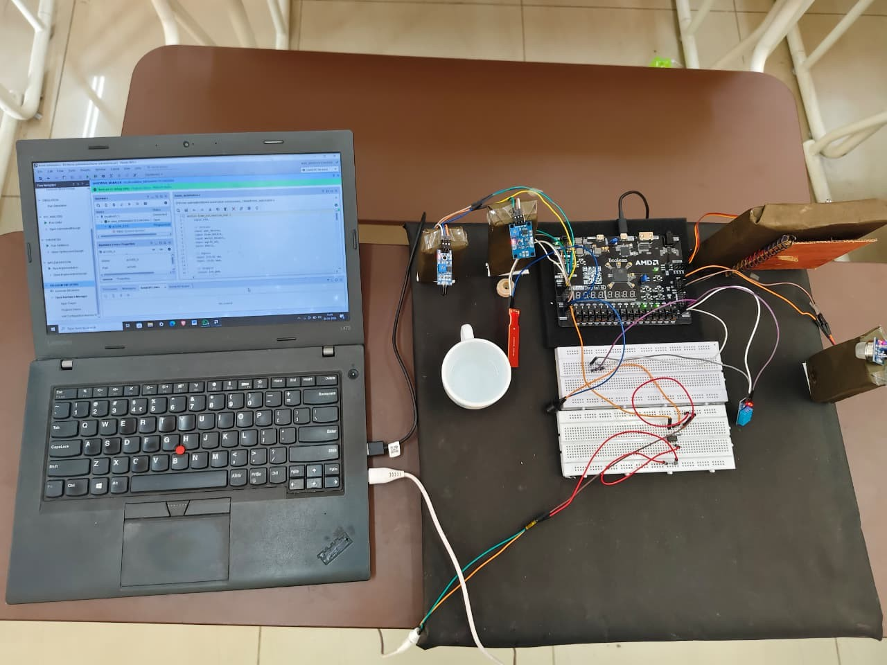
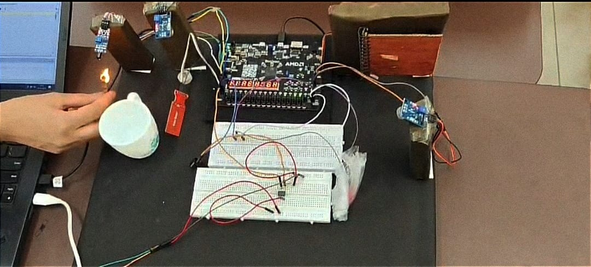
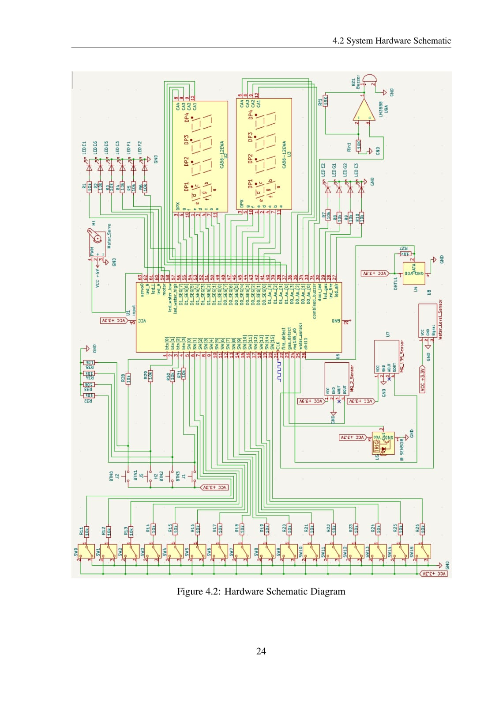

# 🏠 FPGA Based Home Safety and Automation System

A real-time home safety and automation system designed on the **Xilinx Spartan-7 (XC7S50-CSGA324)** FPGA using **Verilog HDL**. The system integrates 6 sensors and a central alarm to monitor gas leaks, fire, air quality, water level, temperature/humidity, and secure entry — all through a single FPGA controller.

Final Year B.Tech Project — Department of Electronics & Communication Engineering, Babasaheb Bhimrao Ambedkar University, Lucknow (2022–2026)

  
  

---

## 📋 Overview

Modern homes need to be both safe and comfortable. This project uses the parallel processing power of an FPGA (instead of a sequential microcontroller) to monitor multiple hazards simultaneously and respond in real time — without any dependency on internet or external network connectivity.

## ⚙️ Features

- 🔥 **Flame Detection** — IR flame sensor triggers alarm + display on fire detection
- 💨 **Gas Leak Detection** — MQ-2 sensor monitors for combustible gas leaks
- 🌫️ **Air Quality Monitoring** — MQ-135 sensor detects poor indoor air quality
- 💧 **Water Level Monitoring** — Auto-activates motor on low level, alarms on overflow
- 🌡️ **Temperature & Humidity Monitoring** — DHT11 sensor with range-based LED indication
- 🔒 **Password-Based Door Lock** — Servo-controlled lock, opens only on password match
- 🚨 **Central Alarm System** — Unified buzzer alert triggered by any hazard condition
- 📟 **Seven-Segment Display** — Real-time status messages for each subsystem

## 🧰 Tech Stack

| Category | Tools/Components |
|---|---|
| FPGA Board | AMD/Xilinx Spartan-7 (XC7S50-CSGA324) |
| HDL | Verilog |
| Design Software | Xilinx Vivado |
| Schematic Design | KiCad |
| Sensors | MQ-2 (gas), MQ-135 (air quality), DHT11 (temp/humidity), IR flame sensor, water level sensor |
| Actuators | Servo motor (door lock), active buzzer (alarm) |

## 🏗️ System Architecture

All sensors and components connect to the FPGA through GPIO pins:

| Component | FPGA Pin |
|---|---|
| Flame Sensor | C17 |
| Gas Sensor (MQ-2) | B18 |
| Air Quality Sensor (MQ-135) | R7 |
| Water Level Sensor | C14 |
| Servo (Door Lock) | J4 / S0 |
| DHT11 (Temp/Humidity) | L4 |
| Buzzer (via LM358 op-amp) | C13 |)

  
   <em>Hardware schematic — sensor and component interconnections (KiCad)</em>

## 📁 Repository Structure
